# JOINS

## Знакомство с соединениями

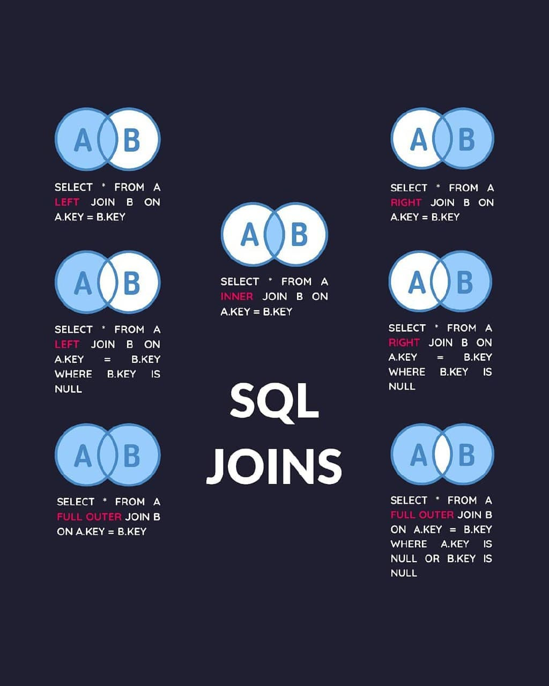

Важным компонентом любой системы реляционных баз данных является связь между таблицами. Это отношение облегчает соединение двух таблиц на основе данных, которые у них «общие». Оно выполняется с помощью JOIN, который представляет собой операцию, что сопоставляет строки из одной таблицы со строками в другой. Сопоставление выполняется таким образом, чтобы столбцы обеих таблиц располагались рядом, хотя они могли быть получены из отдельных таблиц. Однако следует сказать, что чем меньше таблиц объединяется, тем быстрее будет выполняться запрос. 

Рассмотрим соединение на примере двух таблиц:

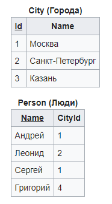

### ВНУТРЕННЕЕ СОЕДИНЕНИЕ (INNER JOIN)

Это самый простой тип объединения, где каждая строка в одной таблице сопоставляется со всеми другими строками в другой таблице. Только если условие соединения оценивается как истинное. Общие данные должны быть истинными для обеих таблиц, участвующих в JOIN.

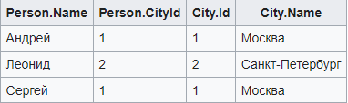

### ЛЕВОЕ СОЕДИНЕНИЕ (LEFT JOIN)

Это СОЕДИНЕНИЕ извлекает все записи в таблице, которые находятся (буквально) в ЛЕВУЮ сторону от условия соединения И  любые столбцы, которые соответствуют таблице в ПРАВОЙ стороне условия. Таким образом, записи без соответствующих данных в правой таблице будут иметь тип NULL.

Результат:

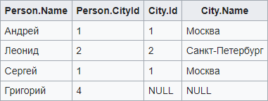

### ПРАВОЕ СОЕДИНЕНИЕ (RIGHT JOIN)

Это СОЕДИНЕНИЕ делает инверсию ЛЕВОГО СОЕДИНЕНИЯ. Он возвращает все записи из таблицы справа со всеми строками, которые могут соответствовать условию из левой таблицы. Таким же образом значения NULL возвращаются для столбцов в левой таблице для строк, которые не соответствуют условию JOIN.

### ПЕРЕКРЕСТНОЕ СОЕДИНЕНИЕ (CROSS JOIN)

Перекрестное соединение возвращает столько комбинаций всех строк, сколько содержатся в соединенных таблицах. То есть каждая строка левой таблицы объединяется с каждой строкой в правой таблице. Следовательно, если в таблице A имеется всего M строк, а в таблице B - N строк, перекрестное соединение приведет к созданию M x N строк

Результат: 

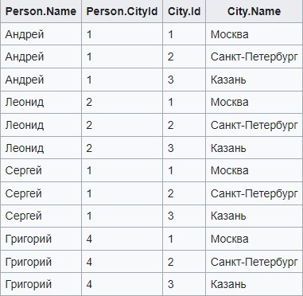

### Полное соединение (FULL JOIN)

Оператор полного внешнего соединения FULL OUTER JOIN соединяет две таблицы.

Тело результата логически формируется следующим образом. Пусть выполняется соединение первой и второй таблиц по предикату (условию) p. Слова «первой» и «второй» здесь не обозначают порядок в записи выражения (который неважен), а используются лишь для различения таблиц.

- В результат включается внутреннее соединение (INNER JOIN) первой и второй таблиц по предикату p.
- В результат добавляются те строки первой таблицы, которые не вошли во внутреннее соединение на шаге 1. Для таких строк столбцы, соответствующие второй таблице, заполняются значениями NULL.
- В результат добавляются те строки второй таблицы, которые не вошли во внутреннее соединение на шаге 1. Для таких строк столбцы, соответствующие первой таблице, заполняются значениями NULL.
  
Результат:

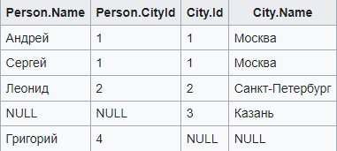

--------

## INNER JOIN

#### Выведем наименование продукта, наименование компании и количество этого продукта в продаже.

```sql
SELECT product_name, company_name, units_in_stock
FROM products 
INNER JOIN suppliers ON products.supplier_id = suppliers.supplier_id
ORDER BY units_in_stock DESC
LIMIT 10
```

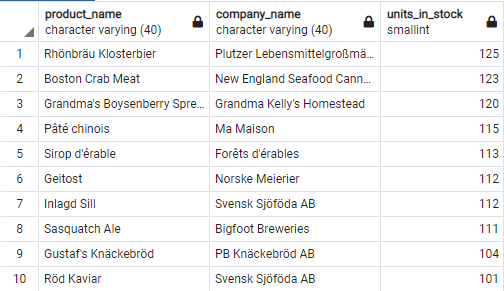


#### Подсчитаем, сколько единиц товара в продаже по их категориям.

```sql
SELECT category_name, SUM(units_in_stock)
FROM products 
INNER JOIN categories ON products.category_id = categories.category_id
GROUP BY category_name
ORDER BY SUM(units_in_stock) DESC
```

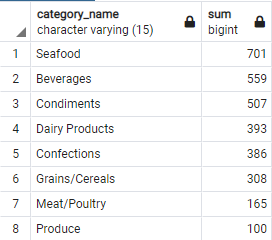

#### Подсчитаем, на какую сумму есть товара в продаже по его категориям. Применим фильтр и пост-фильтрацию

```sql
SELECT category_name, SUM(unit_price * units_in_stock)
FROM products 
INNER JOIN categories ON products.category_id = categories.category_id
WHERE discontinued <> 1
GROUP BY category_name
HAVING SUM(unit_price * units_in_stock) > 5000
ORDER BY SUM(unit_price * units_in_stock) DESC
```

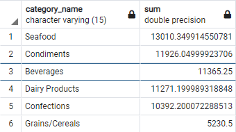

#### Посмотрим, на каких работников завязаны заказы

```sql
SELECT order_id, customer_id, first_name, last_name, title
FROM orders
INNER JOIN employees ON orders.employee_id = employees.employee_id
```

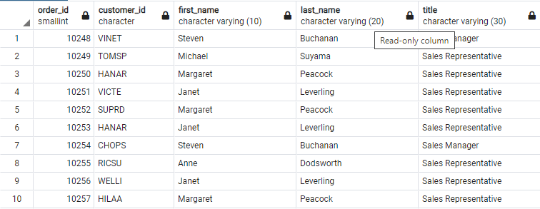

#### Множественное соединение

```sql
SELECT order_date, product_name, ship_country, products.unit_price, quantity, discount
FROM orders
INNER JOIN order_details ON orders.order_id = order_details.order_id --USING(order_id)
INNER JOIN products ON order_details.product_id = products.product_id --USING(product_id)
```

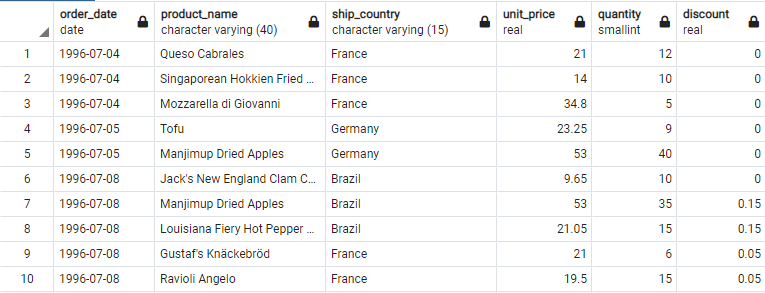

## LEFT, RIGHT JOIN

#### Выведем на экран компании, которые без заказов.

```sql
SELECT company_name, order_id
FROM customers
LEFT JOIN orders ON orders.customer_id = customers.customer_id
WHERE order_id IS NULL
```


## AS-псевдонимы

#### Первый пример 

```sql
SELECT COUNT(*) AS employees_count
FROM employees
```


**Псевдонимы нельзя использовать в блоке WHERE и HAVING**

