# Простые запросы с SELECT

## Выборка и арифметические операции

Выведем товары а в другой колонке полную стоимость, на которую в нас хранится даного товара

```sql
SELECT product_id, product_name, unit_price * units_in_stock 
FROM products 
```
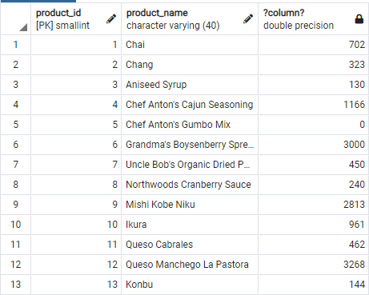

## DISTINCT

**DISTINCT** используется для выборки уникальных значений. К примеру у нас несколько сотрудников проживают в Лондоне и Сиэтле. Благодаря следующему запросу мы получим только уникальные записи этих городов без дубликатов.

```sql
SELECT DISTINCT city, country
FROM employees
```
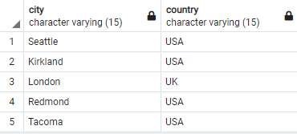

## COUNT

**COUNT** используется для подсчёта количества строк.

Подсчитаем количество стран, в которых наши сотрудники работают. Для этого объеденим **COUNT** и **DISTINCT**

```sql
SELECT COUNT(DISTINCT country) 
FROM employees
```
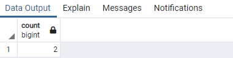

## WHERE

**WHERE** позволяет накладывать ограничения по значениям из какого-то столбца. К примеру, отфильтруем столбец **order_date** и выведем заказы, сделанные после 1 марта 1998 года: 

```sql
SELECT *
FROM orders
WHERE order_date > '1998-03-01'
```
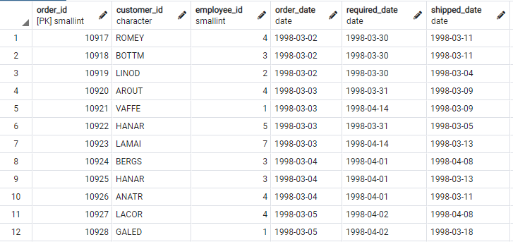


## ORDER BY

**ORDER BY** используется для сортировки записей по возрастанию или по убыванию.
Отсортируем таблицу по двум колонкам, по странам и по городам:

```sql
SELECT DISTINCT country, city 
FROM customers
ORDER BY country DESC, city ASC
```
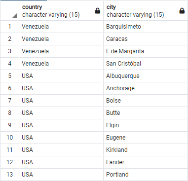

## MIN, MAX, AVG

Агрегатные функции для поиска минимального, максимального и среднего значения.

К примеру, самый старый и самый новый заказы из Лондона
```sql
SELECT MIN(order_date)
FROM orders
WHERE ship_city = 'London'

SELECT MAX(order_date)
FROM orders
WHERE ship_city = 'London'
```
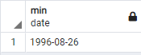

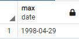

А также среднее значение непроданных товаров:
```sql
SELECT AVG(unit_price)
FROM products
WHERE discontinued <> 1
```
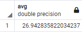

Подсчитаем полное количество продаваемых продуктов, для этого используем **SUM**
```sql
SELECT SUM(units_in_stock)
FROM products
WHERE discontinued <> 1
```
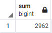

## LIKE
Это ключевое слово позволяет искать строки похожие на заданный шаблон

Имеет два placeholder(заполнитель)

**%** - означающий 0, 1 или более символов

**_** - означающий ровно 1 любой символ

Например,
```sql
LIKE 'U%' -- соответсвует всем строкам, которые начинаются с U
LIKE '%a' -- строки, кончающиеся на a
LIKE '%John%' -- строки, содержащие John
LIKE 'J%a' -- строки, которые начинаются на J и кончаются на а
LIKE '_oh_' -- строки где 2 и 3 символ o и h соответственно, а первый и последний любые
LIKE '_oh%' -- строки где 2 и 3 символ o и h соответственно, первый любой и в конце 0, 1 или более символов 
```

Найдем всех сотрудников, имя которых заканчивается на **n**

```sql
SELECT last_name, first_name
FROM employees
WHERE first_name LIKE '%n'
```


## GROUP BY
Подсчитаем количесвто заказов и сгрупируем их по странам. Выведем на экран только первые 10 стран.
```sql
SELECT ship_country, COUNT(*)
FROM orders
WHERE freight > 50
GROUP BY ship_country
ORDER BY COUNT(*) DESC
LIMIT 10
```
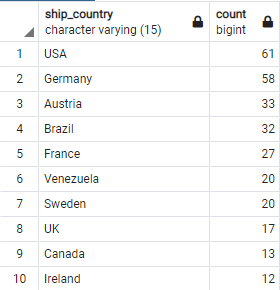

Подсчитаем сумму всех товаров, сгруперованных по их id.
```sql
SELECT category_id, SUM(units_in_stock)
FROM products
GROUP BY category_id
ORDER BY SUM(units_in_stock) DESC
LIMIT 5
```
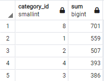

## HAVING
Служит вторичным фильтром.

Подсчитаем суму, на которую продается товаров в какой-то категории. Сгрупируем по **category_id** и подсчитать сумму **unit_price** * **units_in_stock**. Наложим фильтр, и виведем товары которые еще будут продаваться (discontinued <> 1). Нужно вывести на экран категории, сума товаров которых больше 5000 у.е. 

Наложим пост-фильтр HAVING
```sql
SELECT category_id, SUM(unit_price * units_in_stock)
FROM products
WHERE discontinued <> 1
GROUP BY category_id
HAVING SUM(unit_price * units_in_stock) > 5000
ORDER BY SUM(unit_price * units_in_stock) DESC
```

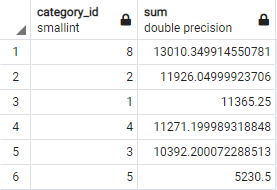

## UNION, INTERSECT, EXCEPT
Эти ключевые слова помогают работать с множествами.

Выведем все страны, из которых заказчики и работники.

```sql
SELECT country
FROM customers
UNION
SELECT country
FROM employees
```
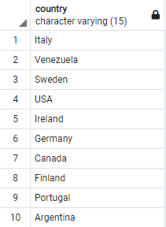

Есть еще ключевое слово **UNION ALL**, которое позволяет отображать дубликаты.
```sql
SELECT country
FROM customers
UNION ALL
SELECT country
FROM employees
ORDER BY country
```
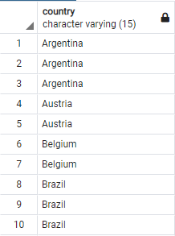

Пересечение двох множеств. Выводим список стран, где есть одновременно и работники, и заказчики. 

```sql
SELECT country
FROM customers
INTERSECT
SELECT country
FROM employees
ORDER BY country
```
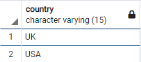

Выведем на экран список стран где проживают клиенты, но не проживают работники.
```sql
SELECT country
FROM customers
EXCEPT
SELECT country
FROM employees
ORDER BY country
LIMIT 10
```
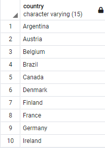

Аналогично с **UNION** можно отобразить дубликаты.
