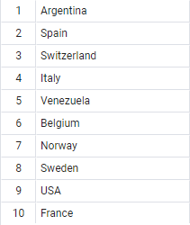
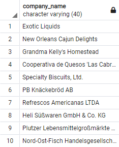
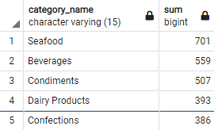
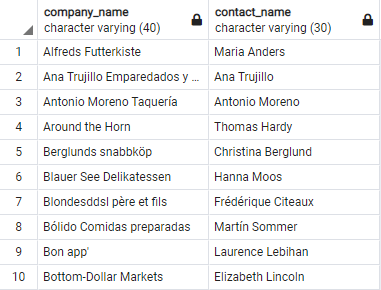
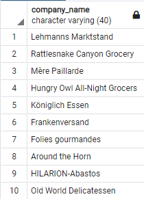
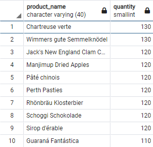
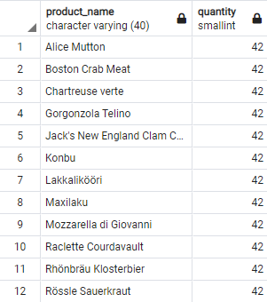

# Подзапросы

#### Найдем все компании поставщиков из тех стран, в которых есть заказчики.

Такой запрос выведет на экран все страны, в которых проживают заказчики.

```sql
SELECT DISTINCT country
FROM customers
```



И из результата этого запроса нам нужно найти пересечения множетсва стран, в которых проживают заказчики и компании-поставщики. Сделать это можно благодаря подзапросу.

```sql
SELECT company_name
FROM suppliers
WHERE country IN (SELECT DISTINCT country
				  FROM customers)
```



Аналогичный вывод даст следующий запрос с использованием соединений:

```sql
SELECT DISTINCT suppliers.company_name
FROM suppliers
JOIN customers USING(country)
```

Подзапрос может находится в разных частях полсе разных ключевых слов внешнего запроса:

```sql
SELECT category_name, SUM(units_in_stock)
FROM products
INNER JOIN categories USING(category_id)
GROUP BY category_name
ORDER BY SUM(units_in_stock) DESC
LIMIT(SELECT MIN(product_id) + 4 FROM products)
```



#### Выведем такие товары, количесвто которого в наличии больше, чем в среднем

```sql
SELECT product_name, units_in_stock
FROM products
WHERE units_in_stock > (SELECT AVG(units_in_stock) FROM products)
ORDER BY units_in_stock DESC
```


## WHERE EXISTS

Оператор **EXISTS** позволяет проверить, возвращает ли подзапрос какое-либо значение. Как правило, этот оператор используется для индикации того, что какая-либо строка удовлетворяет условию. То есть фактически оператор **EXISTS** не возвращает строки, а лишь указывает, что в базе данных есть как минимум одна строка, которые соответствует данному запросу. Поскольку возвращения набора строк не происходит, то подзапросы с подобным оператором выполняются довольно быстро.

#### Выберем компании и имена заказчиков, которые делали заказы между 1 и 15 февраля 1995 года.

```sql
SELECT company_name, contact_name
FROM customers
WHERE EXISTS (SELECT customer_id FROM orders
			 WHERE customer_id = customers.customer_id
			 AND order_date BETWEEN '1995-02-01' AND '1995-02-15')
```

Результат будет пустая таблица, значит таких заказов в этот период нет.

Инвертируем этот запрос, добавив ключевое слово **NOT**

```sql
SELECT company_name, contact_name
FROM customers
WHERE NOT EXISTS (SELECT customer_id FROM orders
			 WHERE customer_id = customers.customer_id
			 AND order_date BETWEEN '1995-02-01' AND '1995-02-15')
```

Заказов в остальной люой период полным-полно




#### Выберем продукты, которые не покупались в период с 1 по 15 февраля 1995 года

```sql
SELECT product_name
FROM products
WHERE NOT EXISTS (SELECT orders.order_id FROM orders
				 JOIN order_details USING(order_id)
				 WHERE order_details.product_id = product_id
				 AND order_date BETWEEN '1995-02-01' AND '1995-02-15') 
```

## Подзапросы с квантификаторами ANY, ALL

Операторы **ANY** и **ALL** используются с предложением **WHERE** или **HAVING**. Оператор **ANY** возвращает true, если какое-либо из значений подзапроса соответствует условию. Оператор **ALL** возвращает true, если все значения подзапроса удовлетворяют условию.

#### Выберем все уникальные компании заказчиков, которые делали заказов на более чем 40 единиц товара

```sql
SELECT DISTINCT company_name
FROM customers
INNER JOIN orders USING(customer_id)
INNER JOIN order_details USING(order_id)
WHERE quantity > 40
```

Перепишем даный запрос на запрос с подзапросом.

```sql
SELECT DISTINCT company_name
FROM customers
WHERE customer_id = ANY(
	SELECT customer_id
	FROM orders
	INNER JOIN order_details USING(order_id)
	WHERE quantity > 40)
```




#### Выберем такие продукты, количество которых больше среднего по заказам

```sql
SELECT DISTINCT product_name, quantity
FROM products
INNER JOIN order_details USING(product_id)
WHERE quantity > (SELECT AVG(quantity)
				  FROM order_details)
ORDER BY quantity DESC
```




#### Необходимо найти все продукты, количество которых больше среднего значения количества заказанных товаров из групп, полученных групированием по product_id

```sql
SELECT DISTINCT product_name, quantity
FROM products
INNER JOIN order_details USING(product_id)
WHERE quantity > ALL(
		SELECT AVG(quantity)
		FROM order_details
		GROUP BY product_id)
ORDER BY quantity
```




